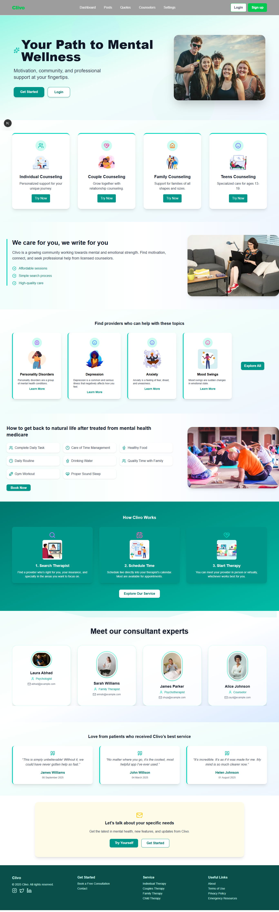

# Clivo - Frontend Integration 🚀

## Overview  
This project is part of the **Clivo** platform — an application aimed at providing a seamless and engaging space for users to view curated posts, connect with counselors, and access exclusive content.  

At this stage, the focus has been on **designing and structuring the landing page** to ensure a clean, modern, and responsive user experience.  

---

## 📌 Current Progress  
✅ Designed and implemented a **fully responsive landing page**  
✅ Created a **clean UI/UX** to showcase the project's vision  
✅ Prepared the project structure for future development  
✅ Set up component structure for **post previews** and **auth-protected content**  

---

## 🖼️ Landing Page Preview  


---

## 🛠️ Tech Stack  

### **Frontend**
- **Next.js 13+ (App Router)** — Modern React framework for SSR and routing
- **TypeScript** — Strict typing for better maintainability
- **Tailwind CSS** — For beautiful, responsive, and modern styling
- **React Query** — Ready for handling data fetching and caching
- **ShadCN/UI** — For polished, reusable UI components

---

## 📂 Project Structure (So Far)

clivo-frontend/client
├── public/ # Public assets
├── src/
│ ├── app/ # Next.js App Router pages
│ │ ├── page.tsx # Landing page
│ │ ├── dashboard/ # Dashboard (in progress)
│ │ └── counselors/ # Counselor profiles (in progress)
│ ├── components/ # Reusable components
│ ├── lib/ # Auth & utility functions
│ └── styles/ # Global styles
└── README.md

---

## 🚧 Next Steps  
- [ ] Implement **user authentication** with NextAuth  
- [ ] Add **post fetching & previews** using React Query  
- [ ] Create **locked post overlays** for unauthenticated users  
- [ ] Build **dashboard widgets**  
- [ ] Connect backend APIs  

---

## 💻 Getting Started  

Clone the repository:  
```bash
git clone https://github.com/mash20-dot/mindspace-backend.git

Install dependencies:
npm install


Run the development server:
npm run dev


Open the app in your browser:
http://localhost:3000
```
---

## 📄 License

This project is licensed under the MIT License.

---
## ✍️ Author

Timex — Frontend Developer

Designed and implemented the landing page UI for Clivo.